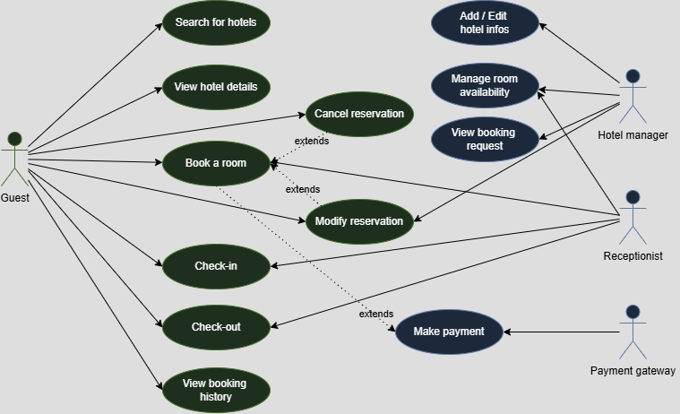

# Requirement Analysis in Software Development

This analysis aims to clarify stakeholder expectations and eliminate ambiguity. By clearly defining the project scope, it helps prevent scope creep and lays a strong foundation for system design and development. It also supports accurate estimation of cost, resources, and timeline, ensuring that the final product aligns with the specified requirements and ultimately boosts customer satisfaction.

# What is Requirement Analysis?

Requirement Analysis is a critical phase in the software development lifecycle (SDLC) where the project team gathers, analyzes, and defines the requirements of the software product to be developed. This process ensures that all stakeholders have a clear and mutual understanding of what the system should do and how it should perform.

# Why is Requirement Analysis Important?

Clarity and Understanding: It helps in understanding what the stakeholders expect from the software, reducing ambiguity.
Scope Definition: Clearly defines the scope of the project, which helps in preventing scope creep.
Basis for Design and Development: Provides a solid foundation for designing and developing the system.
Cost and Time Estimation: Facilitates accurate estimation of project cost, resources, and time.
Quality Assurance: Ensures that the final product meets the specified requirements, leading to higher customer satisfaction.
Key Activities in Requirement Analysis

# Key Activities in Requirement Analysis

1. Requirement Gathering 🗂️
Interviews: Conducting interviews with stakeholders to gather detailed information about their needs and expectations.
Surveys/Questionnaires: Distributing surveys to collect requirements from a larger audience.
Workshops: Organizing workshops with stakeholders to discuss and gather requirements.
Observation: Observing end-users in their working environment to understand their needs.
Document Analysis: Reviewing existing documentation and systems to understand current functionalities and requirements.
2. Requirement Elicitation ✍️
Brainstorming: Conducting brainstorming sessions to generate ideas and gather requirements.
Focus Groups: Holding focus group discussions with selected stakeholders to gather detailed requirements.
Prototyping: Creating prototypes to help stakeholders visualize the system and refine their requirements.
3. Requirement Documentation 📚
Requirement Specification Document: Creating a detailed document that lists all functional and non-functional requirements.
User Stories: Writing user stories to describe functionalities from the user’s perspective.
Use Cases: Creating use case diagrams to show interactions between users and the system.
4. Requirement Analysis and Modeling 📊
Requirement Prioritization: Prioritizing requirements based on their importance and impact on the project.
Feasibility Analysis: Assessing the feasibility of requirements in terms of technical, financial, and time constraints.
Modeling: Creating models (e.g., data flow diagrams, entity-relationship diagrams) to visualize and analyze requirements.
5. Requirement Validation ✅
Review and Approval: Reviewing the documented requirements with stakeholders to ensure accuracy and completeness.
Acceptance Criteria: Defining clear acceptance criteria for each requirement to ensure they meet the expected standards.
Traceability: Establishing traceability matrices to ensure all requirements are addressed during development and testing.

# Types of Requirements

## Functional Requirements ⚙️
These describe what the system should do — its core features and operations:

#### For End Users (Guests):
- **Search for hotels:** Users can search for hotels based on filters like location, date, price, room type, etc.
- **Book a room:** Users can select a hotel and book an available room for a specific period.
- **Online payments:** Users can pay for their bookings via integrated payment gateways.
- **View booking history:** Users can access their past and upcoming reservations.
- **Cancel/modify bookings:** Users should be able to cancel or change existing reservations (if the policy allows).

#### For Hotel Managers:
- **Hotel management:** Ability to add, update, or remove hotel listings and details.
- **Room inventory management:** Update availability, pricing, and room details.
- **Booking monitoring:** View and manage incoming bookings and customer information.

#### General Features:
- **User authentication:** Secure login/sign-up functionality for both guests and hotel managers.
- **Notification system:** Send confirmation emails/SMS after booking, reminders, and alerts.

## Non-functional Requirements 🛡️
These define how the system performs — its quality attributes:

- **Scalability:** The system should support growth in users, hotels, and transactions without performance issues.
- **Availability:** The booking service should be accessible 24/7 with minimal downtime (e.g., 99.9% uptime).
- **Performance:** Fast search, booking, and payment processes (e.g., under 2 seconds response time).
- **Security:** Protect user data and payments through encryption and secure authentication.
- **Reliability:** Ensure data consistency, especially in booking and payment processes — no double bookings!
- **Maintainability:** The system should be modular and easy to update or fix.
- **Usability:** The UI should be user-friendly for both mobile and desktop users.
- **Compliance:** Follow regulations like GDPR for user data protection and PCI DSS for payments.

# Use Case Diagrams

**Objective:** Visual representation of interactions between users and the system.

#### What are Use Case Diagrams?

Use case diagrams show how different users (actors) interact with the system to achieve specific goals (use cases).

#### Creating Use Case Diagrams:

Identify actors (e.g., guest, registered user, admin).
Define use cases (e.g., search properties, book property, manage listings).
Draw interactions between actors and use cases.

#### Benefits of Use Case Diagrams:

Provide a clear visual representation of system functionalities.
Help in identifying and organizing system requirements.
Facilitate communication among stakeholders and development team.

## Use Case Diagrams for the booking system:

# Acceptance Criteria

**Objective:** Establishing clear criteria for feature completion.

#### What is Acceptance Criteria?

Acceptance criteria are conditions that a feature must meet to be accepted by the stakeholders.

#### Benefits of Acceptance Criteria:

- Ensure all parties have a clear understanding of feature requirements.
- Provide a basis for testing and validation.
- Help in maintaining quality and meeting user expectations.
- Putting It All Together 📌

#### Feature: Checkout (Booking Confirmation & Payment)
**User Story Example (for context):** As a user, I want to checkout after selecting a hotel and confirming my booking details, so that I can complete the payment and reserve my stay.

**Acceptance Criteria Example:**
- User can review booking details (hotel name, dates, guests, price breakdown) before proceeding to payment.
- User must be logged in to complete the checkout process.
- User is redirected to a secure payment page upon clicking “Proceed to Payment”.
- System must validate availability of the selected room before final confirmation.
- If payment is successful, user receives a booking confirmation message and reference number.
- A confirmation email is automatically sent to the user after a successful checkout.
- If payment fails, user sees an error message and can retry or change payment method.
- Booking info is saved to the database only after a successful payment.
- Checkout process must complete in under 10 seconds under normal conditions.
- Mobile users can complete checkout with responsive layout and touch-friendly UI.

